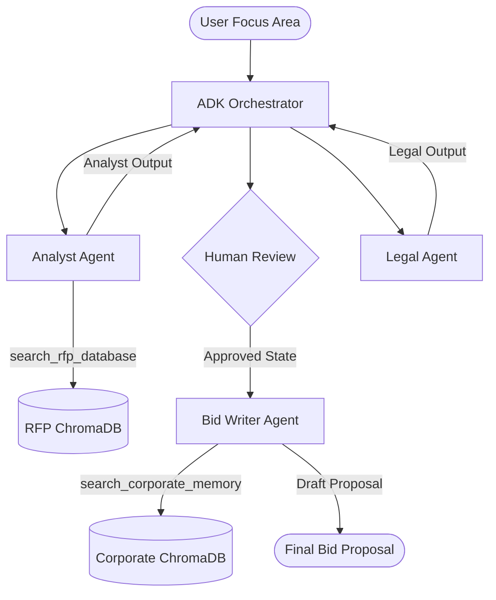

# TenderMind AI: Agent Swarm Conventions

This document defines the global architecture, roles, interaction patterns, and safety constraints for the TenderMind AI agent swarm, aligning with Google's Agentic Engineering standards.

---

## Swarm Architecture

The TenderMind AI swarm employs an **Agent-to-Agent (A2A)** pattern under an **orchestrator-led flow**. Each agent is specialized, contains isolated instructions, and has designated tool boundaries.

---

## Agent Registry & Roles

### 1. Analyst Agent
* **Role:** Technical RFP Analyzer.
* **Objective:** Extract technical specifications, deliverables, evaluation criteria, and mandatory requirements.
* **Path:** `skills/analyst/SKILL.md`
* **Tools Allowed:** `search_rfp_database`
* **Safety Bounds:** Strictly reads indexed documents. Cannot hallucinate values not present in the vector database.

### 2. Legal & Compliance Agent
* **Role:** Contractual Risk Assessor.
* **Objective:** Audit analyst findings against compliance, identify financial/performance penalties, and suggest mitigation strategies.
* **Path:** `skills/legal/SKILL.md`
* **Tools Allowed:** None (pure reasoning).
* **Safety Bounds:** Cannot declare legal advice; must focus on business risks and warnings.

### 3. Bid Writer Agent
* **Role:** Proposal Synthesizer.
* **Objective:** Merge analyst deliverables and legal mitigations with corporate history, templates, and methodologies to produce the final bid response.
* **Path:** `skills/writer/SKILL.md`
* **Tools Allowed:** `search_corporate_memory`
* **Safety Bounds:** Must align proposal assertions with actual historical achievements in corporate memory.

---

## State & Message Conventions

1. **State Isolation:** Agents communicate state transitions back to the `ADKOrchestrator`. Direct state mutations must go through orchestrator validation.
2. **Transition Keys:**
   - `analyst_output`: Structure containing markdown bullets of specifications, requirements, and criteria.
   - `legal_output`: Structure containing risks, penalties, and mitigation mappings.
   - `writer_output`: Structured draft containing Executive Summary, Technical Response, and Compliance Matrix.
3. **Safety Guardrails:**
   - All tool arguments (such as queries) must be sanitized before execution.
   - The Orchestrator halts execution after `legal_output` to require Human-In-The-Loop (HITL) approval before invoking the `Bid Writer Agent`.
